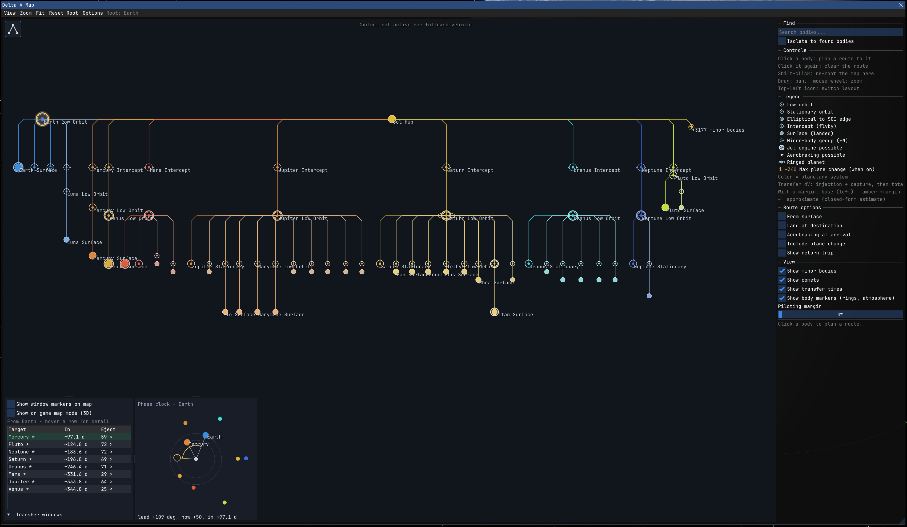
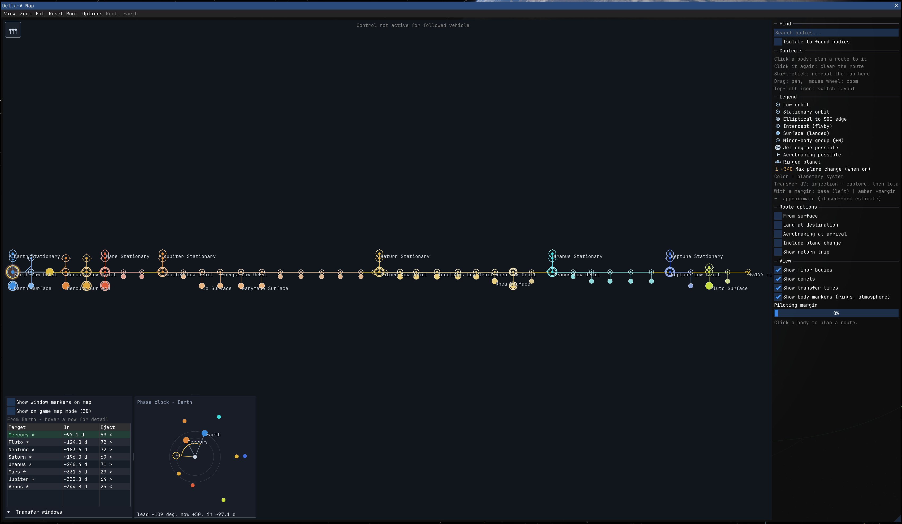
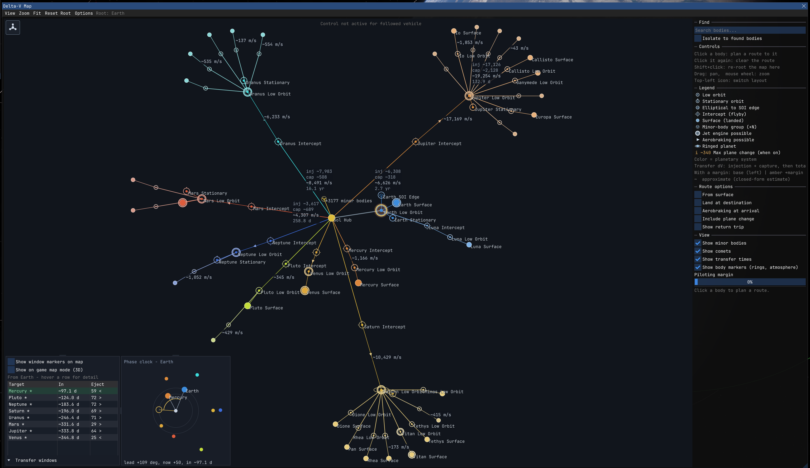
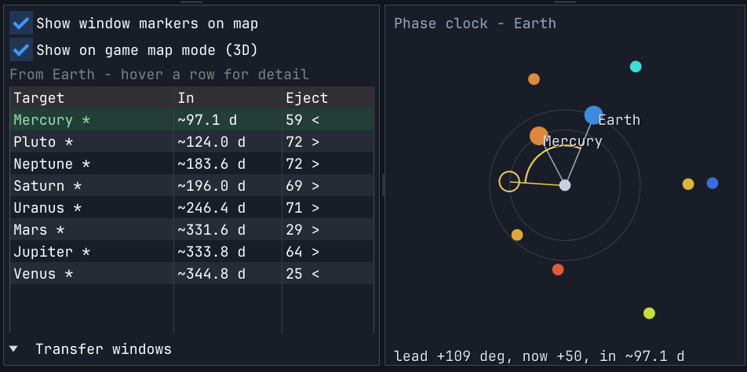
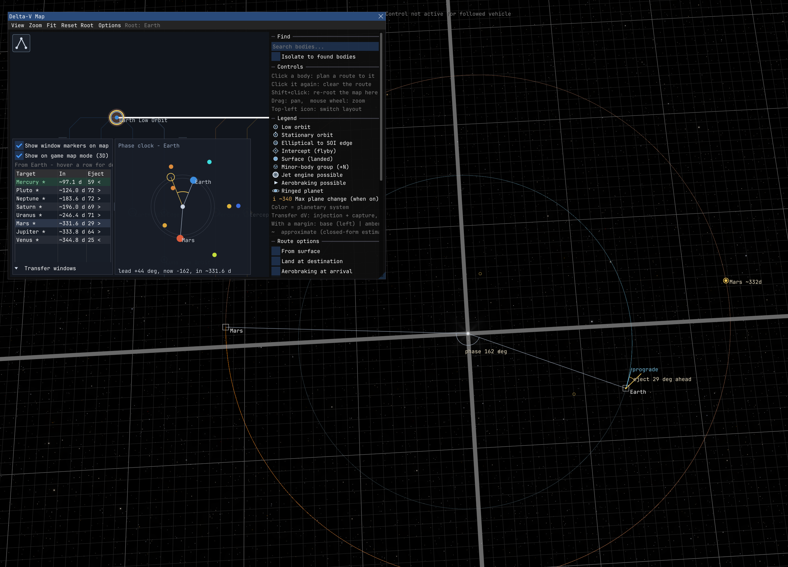

# DeltaVMap [](https://opensource.org/licenses/MIT)

An interactive, auto-generated delta-v subway map and transfer-window planner for [Kitten Space Agency](https://ahwoo.com/app/100000/kitten-space-agency). It reads the loaded solar system live, so it works with any system, stock or modded, with no per-system setup.



This mod is written against the [StarMap loader](https://github.com/StarMapLoader/StarMap).

Validated against KSA build version 2026.6.6.4601.

## What it does

The map tells you "where can I go from where I am and for how much delta-v".
The transfer-window layer answers the "and when do I leave" question.

Both are generated from the loaded `CelestialSystem`, recurse through every planet, moon, asteroid and comet, and read each body's mass, radius, SOI, orbit and atmosphere. Nothing is hardcoded.

All numbers are closed-form patched-conic estimates (Hohmann transfers with Oberth-combined departure and capture, no iterative solver), so the whole map is fast and every transfer is cached once per session.

The delta-v figures are the idealized optimal values, so they assume a well-timed, well-flown transfer. A "piloting-margin percentage" slider is available.

## Features

### Delta-v subway map

- **Ego-centric metro layout.** The body you are currently in is the root; the map re-roots automatically on the next open after an SOI change, and Shift-Click re-roots to any body on demand.
- **Accurate budgets.** Closed-form Hohmann transfers with Oberth-combined ejection and capture, a per-body state ladder (surface, low orbit, stationary, SOI edge, intercept) and a "you are here" marker at your actual orbit.
- **Route planning.** Click any body to highlight the exact route from your current state, with a running total and a per-segment breakdown. Toggles for from-surface, landing, aerobraking, plane change and a return trip, plus a piloting-margin percentage to budget for non-optimal flying.
- **Vehicle comparison.** A bar compares the selected route against your ship's available delta-v.
- **Readable at scale.** Node-symbol vocabulary with a legend, search / focus / isolate, and automatic minor-body aggregation so a dense system (thousands of asteroids) stays usable.
- **Three layout modes**, switched from the on-canvas toggle or the Options menu:

| Cumulative-down (default) | Gravity-well | Spring |
| --- | --- | --- |
|  |  |  |

### Transfer windows

The timing companion to the map. For the root body and every sibling sharing its parent, it shows the optimal phase angle, the live current phase, a countdown to the next window, the synodic period, the ejection angle and the transfer time, in a compact list plus a live polar phase-clock.



A separate, opt-in layer draws the same data in the game's 3D map mode: the optimal-departure marker on the destination's real orbit (where it will be when the window opens), the planet-star-planet phase angle, and an ejection-angle gizmo at the departure body.



## Installation

1. Install [StarMap](https://github.com/StarMapLoader/StarMap).
2. Download the latest release from the [GitHub Releases](https://github.com/Maximilian-Nesslauer/KSA-DeltaVMap/releases) tab or from [SpaceDock](https://spacedock.info/mod/4294/DeltaVMap).
3. Extract into `Documents\My Games\Kitten Space Agency\mods\DeltaVMap\`.
4. The game auto-discovers new mods and prompts you to enable them. Alternatively, add to `Documents\My Games\Kitten Space Agency\manifest.toml`:

```toml
[[mods]]
id = "DeltaVMap"
enabled = true
```

Open the map from the **View** -> "Delta-V Map" menu in flight, or the top-level **Delta-V Map** tab in the editor.

## Dependencies

| Package | Purpose | Tested version |
| --- | --- | --- |
| [StarMap](https://github.com/StarMapLoader/StarMap) | Mod loader, required at runtime (see [Installation](#installation)) | 0.4.5 |

## Build dependencies

Required only to build the mod from source. Targets **.NET 10**.

| Package | Source | Tested Version |
| --- | --- | --- |
| [StarMap.API](https://github.com/StarMapLoader/StarMap) | NuGet | 0.3.6 |
| [Lib.Harmony](https://www.nuget.org/packages/Lib.Harmony) | NuGet | 2.4.2 |

## Mod compatibility

- Known conflicts: none

## Community

Thread on the KSA forums: https://forums.ahwoo.com/threads/deltavmap.978/

## Check out my other mods

- [AdvancedFlightComputer](https://github.com/Maximilian-Nesslauer/KSA-AdvancedFlightComputer) - Transfer Planner quick-tools (set Pe/Ap, match/set inclination, circularize), multi-pass burn splitting, and hyperbolic-target support (Oumuamua, 2I/Borisov, 3I/ATLAS) ([forum thread](https://forums.ahwoo.com/threads/advanced-flight-computer.783/))
- [AutoRemoveFinishedBurns](https://github.com/Maximilian-Nesslauer/KSA-AutoRemoveFinishedBurns) - automatically removes finished auto-burns from the burn plan ([forum thread](https://forums.ahwoo.com/threads/autoremovefinishedburns.928/))
- [AutoStage](https://github.com/Maximilian-Nesslauer/KSA-AutoStage) - automatic staging during auto-burns and manual flight, with configurable ignition delays ([forum thread](https://forums.ahwoo.com/threads/autostage.891/))
- [MeasureTools](https://github.com/Maximilian-Nesslauer/KSA-MeasureTools) - click-to-measure ruler, protractor, and surface measuring in the map view ([forum thread](https://forums.ahwoo.com/threads/measuretools.992/))
- [StageInfo](https://github.com/Maximilian-Nesslauer/KSA-StageInfo) - extra info in the stock Stage/Sequence window: per-stage delta V, TWR, burn time, fuel pool, RCS, and more ([forum thread](https://forums.ahwoo.com/threads/stageinfo.905/))
